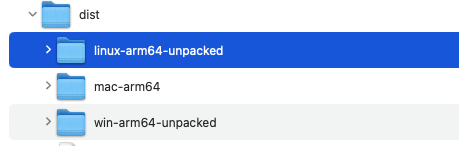
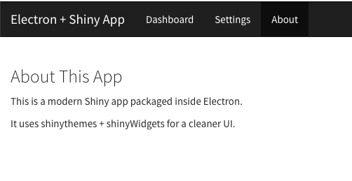
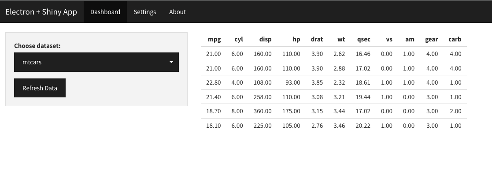

# My Golem Electron App

This project packages a Golem-based R Shiny application inside an Electron desktop app for macOS, and it also builds the images for Linux and Windows.  
It bundles the R runtime (`R.framework`) directly in the app, so no external R installation is required.

---

## Project Structure
```
/electron
  ├── app/                      # Production R script for launching Golem app
  │    └── run_app.R
  ├── main.js                   # Electron main process
  ├── resources/R.framework     # Bundled R runtime (flattened for macOS)
  ├── package.json              # Electron build configuration
  └── scripts/                  # Build helper scripts
       ├── pre_build_fix_rframework.sh
       └── post_build_check.sh
```

---

## Final Run

### Build and deploy

  - cd electron  
  - npm run prod-build

----

  - cd dist

  - /dist folder contains the dmg to be installed. 

  - install .dmg and run the app




  - Launch the app 






---------

## Build Process - Details

### 1. Prepare R.framework
This step flattens `R.framework` (removes `Versions/` symlinks, ensures `PrivateHeaders`, `Headers`, `Libraries`, `Resources` are real folders).
```bash
cd electron
npm run fix-rframework
```

Verify:
```bash
ls electron/resources/R.framework/Resources/bin/Rscript
```
It should exist.

---

### 2. Ensure `run_app.R` is bundled
Place your production launcher script in:
```
electron/app/run_app.R
```
It will be copied into:
```
Contents/Resources/app/run_app.R
```
inside the `.app` at build time.

---

### 3. Build the app
```bash
cd electron
npm run prod-build
```

This runs:
- `fix-rframework`
- `electron-builder`
- `post-build-check` (verifies `Rscript` inside `.app`)

Output:
- `.dmg` and `.zip` in `electron/dist/`

---

## Running the App
- Install `.dmg`
- Open `My Golem Electron` from Applications
- Electron will:
  1. Launch `Rscript run_app.R` from `Contents/Resources/app`
  2. Start Shiny server on fixed port (e.g. `4242`)
  3. Open `http://127.0.0.1:4242` in Electron window

---

