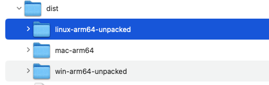
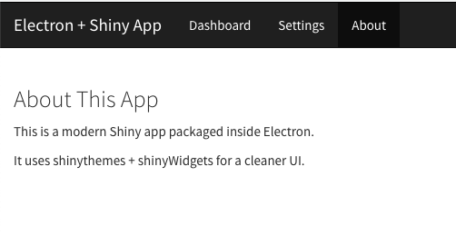
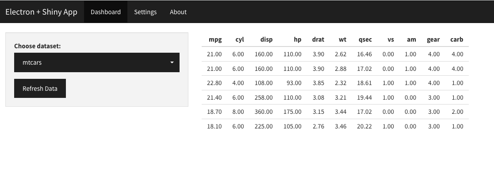

# My Golem Electron App

This project packages a Golem-based R Shiny application inside an Electron desktop app for macOS, and it also builds the images for Linux and Windows.  
It bundles the R runtime (`R.framework`) directly in the app, so no external R installation is required.

---

## Project Structures
```
/electron
  ├── app/                      # Production R script for launching Golem app
  │    └── run_app.R
  ├── main.js                   # Electron main process
  ├── resources/R.framework     # Bundled R runtime (flattened for macOS)
  ├── package.json              # Electron build configuration
  └── scripts/                  # Build helper scripts
       ├── pre_build_fix_rframework.sh
       └── post_build_check.sh
```

---

## Final Run

### Build and deploy

  - cd electron  
  - npm run prod-build

----

  - cd dist

  - /dist folder contains the dmg to be installed. 

  - install .dmg and run the app




  - Launch the app 






---------

## Build Process - Details

### 1. Prepare R.framework
This step flattens `R.framework` (removes `Versions/` symlinks, ensures `PrivateHeaders`, `Headers`, `Libraries`, `Resources` are real folders).
```bash
cd electron
npm run fix-rframework
```

Verify:
```bash
ls electron/resources/R.framework/Resources/bin/Rscript
```
It should exist.

---

### 2. Ensure `run_app.R` is bundled
Place your production launcher script in:
```
electron/app/run_app.R
```
It will be copied into:
```
Contents/Resources/app/run_app.R
```
inside the `.app` at build time.

---

### 3. Build the app
```bash
cd electron
npm run prod-build
```

This runs:
- `fix-rframework`
- `electron-builder`
- `post-build-check` (verifies `Rscript` inside `.app`)

Output:
- `.dmg` and `.zip` in `electron/dist/`

---

## Running the App
- Install `.dmg`
- Open `My Golem Electron` from Applications
- Electron will:
  1. Launch `Rscript run_app.R` from `Contents/Resources/app`
  2. Start Shiny server on fixed port (e.g. `4242`)
  3. Open `http://127.0.0.1:4242` in Electron window

---
### Debugging


Check inside the .app bundle:

tree -L 3 dist/mac/YourApp.app/Contents/Resources


You should see:

Resources/
 ├── app/
 │   └── run_app.R
 ├── R.framework/
 │   ├── Resources/
 │   │   └── bin/Rscript
 └── main.js


 -----------
 

1) Directly from the .app bundle

open dist/mac-arm64/idepGolemPackage.app,  just double–click it in Finder.

2) From the .dmg
If you built a DMG, open it in Finder → drag the app to /Applications → then launch it from Launchpad.

3) From the command line inside the bundle (for debugging)

dist/mac-arm64/idepGolemPackage.app/Contents/MacOS/idepGolemPackage


This way you can see stdout/stderr in your terminal while R starts up.

#### Logs 
dist/mac-arm64/idepGolemPackage.app/Contents/Resources/golem-electron-debug-<timestamp>.log


## Check the packgage

# 0) Point these to your unpacked build

$UNP = 'C:\raghatest\Windows-artifacts\win-unpacked'
$base = "$UNP\resources\resources\R-Portable"
$RS   = if (Test-Path "$base\bin\Rscript.exe") { "$base\bin\Rscript.exe" } else { "$base\bin\x64\Rscript.exe" }
$lib  = "$base\library"

# 1) Find and verify Rscript.exe

$RS = Get-ChildItem "$base\bin\Rscript*.exe" -Recurse -ErrorAction SilentlyContinue |
      Select-Object -First 1 -ExpandProperty FullName
if (-not $RS) { Write-Error "No Rscript.exe under $base"; exit 1 }

Write-Host "Using Rscript: $RS"
& $RS --version
if ($LASTEXITCODE -ne 0) { Write-Error "Rscript failed to run"; exit 1 }

#  2) Print hello
& $RS '--vanilla' '-e' "cat('HELLO\n')". 
if ($LASTEXITCODE -ne 0) { Write-Error "Rscript -e failed"; exit 1 }

# 2.1 ) CHeck shiny - Print Shiny true
$lib = "$base\library"
& $RS '--vanilla' '-e' `
 "lib <- normalizePath(commandArgs(TRUE)[1], winslash='/', mustWork=FALSE);
  .libPaths(c(lib, .libPaths()));
  cat('Has shiny:', requireNamespace('shiny', quietly=TRUE), '\n')" `
 '--args' $lib


# 3.  temp script

$lib = "$base\library"

$rCode = @'
args <- commandArgs(TRUE)
lib  <- normalizePath(args[1], winslash="/", mustWork=FALSE)
.libPaths(c(lib, .libPaths()))
cat("LIB =", lib, "\n")
cat("libPaths =", paste(.libPaths(), collapse=" | "), "\n")
cat("Has shiny:", requireNamespace("shiny", quietly=TRUE), "\n")
'@

$tf = Join-Path $env:TEMP "check_lib.R"
$utf8NoBom = New-Object System.Text.UTF8Encoding($false)
[System.IO.File]::WriteAllText($tf, $rCode, $utf8NoBom)

& $RS '--vanilla' $tf '--args' $lib


# 3.2 Final Run Check of R Script

$APP = "$UNP\resources\app\run_app.R"

$env:R_HOME       = $base
$env:R_LIBS_USER  = "$base\library"
$env:R_LIBS_SITE  = $env:R_LIBS_USER
$env:R_ARCH       = "/x64"
$env:PATH         = "$base\bin;$base\bin\x64;$env:PATH"

& $RS $APP --port 0 --host 127.0.0.1

